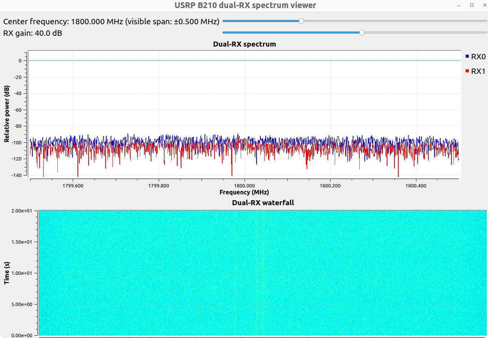
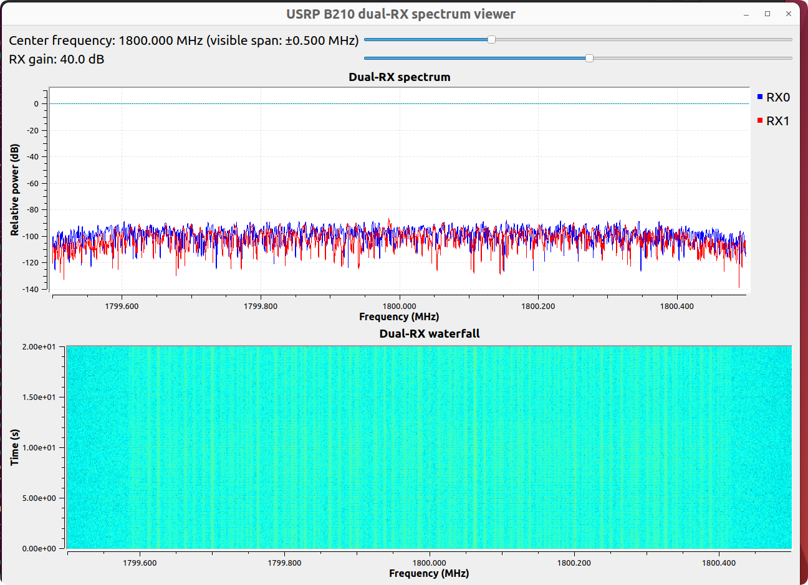

# Linux Run Guide

This guide shows how to start the RX monitor first, then start the TX probe.
Use the realtime CSI monitor for parameter tuning, then capture longer IQ data
after frame detection is stable.

## 1. Check USRP Devices

Connect both B210 devices, then run:

```bash
uhd_find_devices
```

Example:

```text
serial: 326F493
serial: 3271260
```

In the current configuration:

```text
RX device: serial=3271260
TX device: serial=326F493
```

If your cable/antenna setup is reversed, edit `usrp_config.json` and swap the
two serial numbers.

## 2. Edit Runtime Config

Open `usrp_config.json`:

```bash
nano usrp_config.json
```

Important fields:

```json
{
  "radio": {
    "freq": 1800000000.0,
    "rate": 1000000.0
  },
  "rx_gui": {
    "args": "serial=3271260",
    "gain": 40.0,
    "antenna": "TX/RX"
  },
  "tx": {
    "args": "serial=326F493",
    "gain": 30.0,
    "antenna": "TX/RX",
    "probe_rate": 1000.0,
    "tx_scale": 0.5
  }
}
```

Make sure `freq` is allowed in your lab environment and supported by your RF
frontend.

## 3. Start RX First

For parameter tuning, start the realtime CSI monitor:

```bash
cd /path/to/CSI_MIMO_SEN_USRP
python3 rx_csi_monitor_gui.py
```

Or use the launcher:

```bash
bash start_rx_monitor.sh
```

This monitor keeps only a short in-memory IQ buffer. It displays RX power,
preamble correlation, detected frame rate, CFO, and CSI magnitude heatmaps.

After the monitor looks stable, use `rx_capture_2ch.py` for long captures.

The RX scripts read default parameters from `usrp_config.json`. You can still
override them from the command line:

```bash
python3 rx_spectrum_gui.py --args "serial=3271260" --freq 1800e6 --rate 1e6 --gain 40 --antenna TX/RX
```

For the CSI monitor:

```bash
python3 rx_csi_monitor_gui.py --args "serial=3271260" --freq 1800e6 --rate 1e6 --gain 40 --antenna TX/RX --buffer-seconds 0.5 --threshold 0.35
```

Important monitor fields in `usrp_config.json`:

```json
"rx_monitor": {
  "args": "serial=3271260",
  "gain": 40.0,
  "antenna": "TX/RX",
  "buffer_seconds": 0.5,
  "update_interval_ms": 250,
  "threshold": 0.35,
  "min_frame_ratio": 0.8,
  "max_frames_display": 80,
  "probe_rate": 1000.0,
  "tx_scale": 0.5
}
```

Good signs in the monitor:

```text
corr max is clearly above threshold
detected rate is close to tx probe_rate
extracted frames is nonzero and stable
CSI heatmaps are continuous rather than random noise
```

Bad signs:

```text
corr max stays below threshold
detected rate is much lower than probe_rate
extracted frames is often zero
RX terminal reports frequent overflows
TX terminal reports frequent underflows or cmd time errors
```

If detection is weak, first raise TX gain or `tx_scale`. If correlation is near
but below threshold, reduce monitor threshold from `0.35` to `0.25` or `0.15`.
If TX underflows continue, reduce sample rate, close extra GUI windows, and make
sure the B210 is connected through USB 3.0 with reliable host scheduling.

## 3b. Raw Spectrum Viewer

Open terminal 1:

```bash
cd /path/to/CSI_MIMO_SEN_USRP
python3 rx_spectrum_gui.py
```

Or use:

```bash
bash start_rx_gui.sh
```

Wait until the GUI window appears and the spectrum/waterfall starts updating.

## 4. Start TX Second

Open terminal 2:

```bash
cd /path/to/CSI_MIMO_SEN_USRP
python3 tx_mimo_probe.py
```

Or use:

```bash
bash start_tx.sh
```

After TX starts, terminal 2 should print something like:

```text
TX: 1800.000000 MHz, 1.000 MS/s, probe=1000.0 Hz, gain=30.0 dB, frame=1000 samples
Transmitting. Press Ctrl+C to stop.
```

Now look at the RX GUI. You should see a power increase or repeated burst
energy around the configured center frequency.

## 5. OFDM Subcarrier Display

The RX GUI reads the OFDM probe configuration from `csi_probe_common.py`.

Current default values:

```text
sample_rate = 1e6
fft_len = 64
subcarrier_spacing = sample_rate / fft_len = 15.625 kHz
active_carriers = -26..-1 and 1..26
active_carrier_offsets = -406.25 kHz..+406.25 kHz
```

With `freq = 1800e6`, the active carrier center range is:

```text
1799.593750 MHz..1800.406250 MHz
```

The GUI spectrum FFT size is only for display smoothing. It does not change the
OFDM pilot subcarrier spacing. To change the CSI frequency grid, edit
`fft_len` and `active_carriers` logic in `csi_probe_common.py`.

## 6. Stop Scripts

Stop TX in terminal 2:

```bash
Ctrl+C
```

Stop RX by closing the GUI window or pressing:

```bash
Ctrl+C
```

in terminal 1.

## 7. If RX Does Not Change

Check these first:

```text
RX antenna port: device 3271260, port TX/RX
TX antenna port: device 326F493, port TX/RX
Center frequency: same value in RX and TX
Sample rate: same value in RX and TX
```

For a stronger visible spectrum change, temporarily increase TX settings in
`usrp_config.json`:

```json
"tx": {
  "gain": 40.0,
  "tx_scale": 0.8,
  "probe_rate": 1000.0
}
```

## 8. Optional: Capture IQ Instead Of GUI

To record raw RX samples using the same config:

```bash
python3 rx_capture_2ch.py
```

Then start TX in another terminal:

```bash
python3 tx_mimo_probe.py
```

The capture output directory is controlled by:

```json
"rx_capture": {
  "out_dir": "capture_001",
  "seconds": 60.0
}
```

For a quick 5-second capture followed by CSI extraction, keep TX running in
another terminal and run:

```bash
bash capture_5s_and_extract.sh test_rx_5s
```

## Experiment results

启动tx之前：



启动Tx之后：可以看到52个子载波对应频率的功率升高

