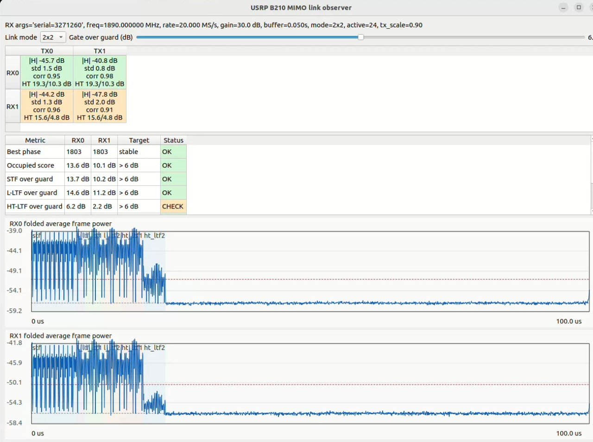
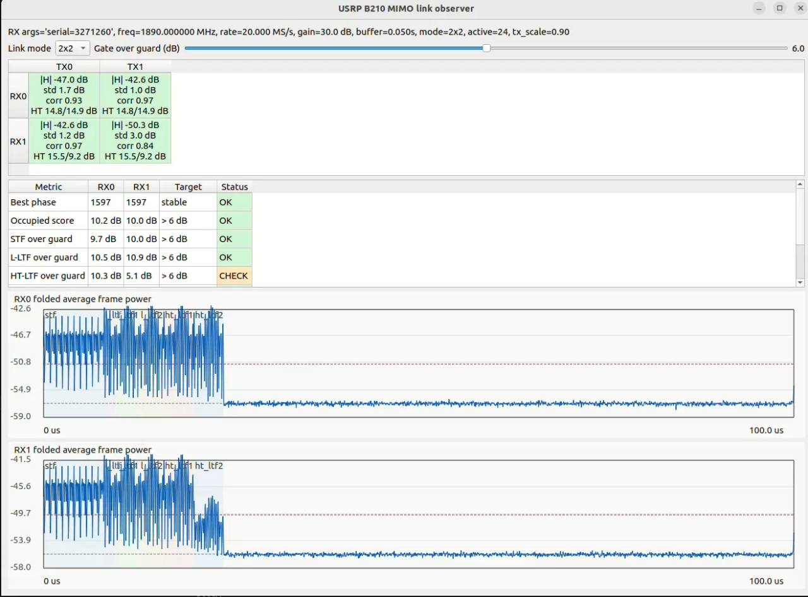

# HT-LTF2 变弱现象记录与原因分析

## 1. 现象记录

本次 2x2 MIMO raw-IQ frame observer 中，完整 frame 的 STF、L-LTF、HT-LTF 区域都能够在接收端看到，说明当前 TX 并不是只发出了同步段，也不是 HT-LTF 整体缺失。

截图记录如下：



从截图中可以看到：

- `STF over guard` 和 `L-LTF over guard` 均达到 OK。
- `HT-LTF over guard` 在 RX0 约为 `6.2 dB`，但在 RX1 约为 `2.2 dB`，RX1 被标记为 CHECK。
- 链路矩阵中，RX0 的 HT1/HT2 SNR 约为 `19.3/10.3 dB`，RX1 的 HT1/HT2 SNR 约为 `15.6/4.8 dB`。
- `|H|` 和 `corr` 指标仍然能够给出 2x2 链路结果，例如 RX0<-TX0、RX0<-TX1、RX1<-TX0、RX1<-TX1，但第二个 HT-LTF 的质量明显更差。

这说明问题更像是 2x2 MIMO 训练结构在真实无线信道下出现了某种接收端抵消，而不是单纯的 frame 没有发射。

## 2. 当前 2x2 HT-LTF 训练结构

当前实现使用了一个简化的 Walsh 正交结构。设单个 HT-LTF 的已知频域训练序列为：

```text
x[k]
```

第一个 HT-LTF 符号中，TX0 和 TX1 同相发送：

```text
X1[k] = [ x[k],  x[k] ]^T
```

第二个 HT-LTF 符号中，TX0 和 TX1 反相发送：

```text
X2[k] = [ x[k], -x[k] ]^T
```

对任意接收天线 `r`，如果它到 TX0、TX1 的真实频域信道分别为：

```text
H_r0[k], H_r1[k]
```

则两个 HT-LTF 接收符号近似为：

```text
Y_r1[k] = (H_r0[k] + H_r1[k]) x[k] + W_r1[k]
Y_r2[k] = (H_r0[k] - H_r1[k]) x[k] + W_r2[k]
```

其中 `W_r1[k]` 和 `W_r2[k]` 是噪声、残余 CFO、采样时钟偏差、多径截断误差和定时误差的综合影响。

因此，理论 CSI 可以通过加减恢复：

```text
Hhat_r0[k] = (Y_r1[k] + Y_r2[k]) / (2 x[k])
Hhat_r1[k] = (Y_r1[k] - Y_r2[k]) / (2 x[k])
```

## 3. 为什么 HT-LTF2 会变弱

当前 HT-LTF2 本质上对应接收端看到的差分项：

```text
Y_r2[k] = (H_r0[k] - H_r1[k]) x[k] + W_r2[k]
```

如果在某个接收天线上，TX0 和 TX1 到该 RX 的信道比较接近：

```text
H_r0[k] ≈ H_r1[k]
```

那么：

```text
H_r0[k] - H_r1[k] ≈ 0
```

于是第二个 HT-LTF 的有效接收能量会明显下降：

```text
Y_r2[k] ≈ W_r2[k]
```

这时 HT-LTF2 看起来就会接近噪声，表现为：

- `HT-LTF2` 时域功率比 `HT-LTF1` 低。
- `HT2 SNR` 明显低于 `HT1 SNR`。
- 通过 `Y1/Y2` 解出的 2x2 CSI 对噪声更敏感。
- 相邻 frame 的复数 CSI 稳定性会变差。

这不是多径本身“不应该存在”的问题。相反，它说明当前训练矩阵过于简单，直接用同相/反相两个符号来分离 TX0/TX1，在某些真实空间信道中会把一个训练维度变成差分小信号。

## 4. 为什么不应简单判断为 frame 未发射

如果 HT-LTF2 完全没有发射，通常会看到以下现象：

- TX debug waveform 中 HT-LTF2 区域本身为空或接近零。
- RX0 和 RX1 上 HT-LTF2 都系统性接近噪声。
- 不同位置、不同天线方向下 HT-LTF2 始终无法恢复。

但当前现象不是这样：

- TX waveform 检查中，HT-LTF 区域已经能够看到完整占用。
- RX0 上 HT-LTF2 仍有约 `10.3 dB` 的频域 SNR。
- RX1 上 HT-LTF2 更弱，说明它更像和具体链路 `H_r0 - H_r1` 有关。

因此，本次更合理的结论是：

```text
当前 2x2 HT-LTF 训练已经发射，但第二个训练维度在部分接收通道上发生了差分抵消。
```

## 5. 与标准 Wi-Fi MIMO 的差距

标准 Wi-Fi MIMO 训练不会只依赖两个天线简单同相/反相叠加。实际系统会引入：

- cyclic shift diversity，简称 CSD。
- spatial mapping。
- 每个空间流的正交训练矩阵。
- 接收端的包检测、粗 CFO、精细 CFO、符号边界定位、信道估计和残余相位跟踪。

CSD 的作用是让不同 TX 的训练序列在频域产生确定的相位斜率，从而降低两个发射天线在接收端完全同相或完全反相抵消的概率。

如果对 TX1 加入循环移位 `n_cs`，频域上可以写成：

```text
D[k] = exp(-j 2 pi k n_cs / Nfft)
```

则两个 HT-LTF 可以改为：

```text
X1[k] = [ x[k],  D[k] x[k] ]^T
X2[k] = [ x[k], -D[k] x[k] ]^T
```

接收端相应为：

```text
Y_r1[k] = (H_r0[k] + H_r1[k] D[k]) x[k] + W_r1[k]
Y_r2[k] = (H_r0[k] - H_r1[k] D[k]) x[k] + W_r2[k]
```

这样即使 `H_r0[k]` 和 `H_r1[k]` 在某些子载波上接近，也不容易在全部子载波和全部接收天线上同时出现严重差分抵消。

## 6. 下一步实验建议

本项目后续实现应优先加入 TX1 cyclic shift，而不是只继续提高 TX gain：

- 在 frame 生成中增加 `tx1_cyclic_shift_samples` 配置。
- 20 MS/s 下可以先测试 `4 samples`，对应约 `200 ns`。
- TX1 的 HT-LTF 和必要的同步训练段都应用同一个确定 shift。
- CSI 解算时把 `D[k]` 纳入训练矩阵，而不是继续按纯 `[1, 1] / [1, -1]` 解算。

建议验证流程：

- 先用 `02_iq_capture/start_rx_mimo_link_observer.sh --link-mode 2x2` 观察 HT1/HT2 SNR。
- 目标是 RX0 和 RX1 上 `HT-LTF over guard` 都稳定大于 `6 dB`。
- 再采集 `0.1 s` raw IQ。
- 最后用 `03_csi_extraction/extract_csi_wifi_like.py` 提取 CSI，并比较相邻 frame 的幅度稳定性和复数相关性。

如果 cyclic shift 后 HT-LTF2 仍然弱，则需要进一步引入更接近 802.11n 的 spatial mapping 和更完整的 per-packet synchronization 流程。

## 7. 后续代码实现要求

为避免 TX、GUI 和离线 CSI 提取三处公式不一致，CSD 实现必须满足：

- TX 端在 `common/frame_design.py` 中统一生成 TX1 的 cyclic-shifted LTF。
- `probe_metadata.json` 必须记录 `tx1_cyclic_shift_samples`。
- 实时 MIMO link observer 必须从 metadata 读取 CSD 参数，并用同一个 2x2 训练矩阵求解。
- 离线 `extract_csi_wifi_like.py` 也必须用同一个训练矩阵求解，不能继续使用旧的 `(Y1+Y2)/(2X)` 与 `(Y1-Y2)/(2X)` 固定公式。

加入 CSD 后，解算矩阵变为每个子载波独立：

```text
[Y1[k]/X[k]]   [1   D[k] ] [H0[k]]
[Y2[k]/X[k]] = [1  -D[k] ] [H1[k]]
```

接收端应直接求解这个 2x2 线性方程，而不是把 `D[k]` 忽略掉。

## 8. 天线极化调整后的补充观察

后续实验中，将两个 TX 天线都调整为约 `45 deg` 倾斜后，MIMO link observer 显示 RX0 的 HT-LTF2 明显恢复正常：



截图中的关键现象：

- RX0 的 `HT-LTF over guard` 约为 `10.3 dB`，已经稳定 OK。
- RX0<-TX0 的 HT1/HT2 SNR 约为 `14.8/14.9 dB`。
- RX0<-TX1 的 HT1/HT2 SNR 约为 `14.8/14.9 dB`。
- RX1 的 `HT-LTF over guard` 约为 `5.1 dB`，仍略低于 `6 dB` 目标，但相比之前 HT-LTF2 近似异常的情况已经改善。
- RX1<-TX0 的 HT1/HT2 SNR 约为 `15.5/9.2 dB`。
- RX1<-TX1 的 HT1/HT2 SNR 约为 `15.5/9.2 dB`。

这个结果说明，HT-LTF2 变弱不只是代码层面的 frame 缺失问题。天线姿态和极化方向改变后，`H_r0[k]` 与 `H_r1[k]` 的相对幅度和相位发生变化，使原先可能较小的差分项：

```text
H_r0[k] - H_r1[k]
```

重新变得可观测。因此，这个实验支持如下判断：

```text
HT-LTF2 弱主要与 TX0/TX1 到同一 RX 的空间信道相似度、极化耦合和差分抵消有关。
```

工程上的结论是：

- 后续采集 CSI 时，需要记录 TX/RX 天线的姿态、间距、极化方向和遮挡条件。
- 仅靠提高 TX gain 不能从根本上解决 HT-LTF2 差分抵消。
- cyclic shift / CSD 仍然必要，因为它可以降低训练维度对某一种天线姿态的依赖。
- 如果旋转天线后 HT-LTF2 恢复，说明当前 RF 链路和 frame 发射大概率是正常的，问题更偏向 MIMO 训练矩阵与空间信道条件的耦合。

## 9. CSD 首次 GUI 测试的问题记录

首次将 `tx1_cyclic_shift_samples=4` 加入后，GUI 观察到一个新的异常：

- HT1/HT2 的频域 SNR 下降到约 `0.7/0.8 dB`。
- folded frame power 的 guard 区域出现不应有的高功率波动。
- RX1 的 occupied score、STF、L-LTF、HT-LTF over guard 均变差。

这说明第一次实现把 CSD 同时作用到同步段和 HT-LTF 段后，可能干扰了本项目当前的 frame folding、包边界观察和 L-LTF 对齐。虽然标准系统中会有完整的包检测和同步流程来处理多 TX 链的循环移位，但当前 GUI 仍依赖短缓存中的平均功率折叠来寻找 frame 起点，因此同步段不宜先引入额外变化。

因此，后续代码修正为：

```text
STF / L-LTF:  不加 CSD，保持同步段稳定
HT-LTF:       对 TX1 加 CSD，用于 MIMO sounding
```

这是一种更保守的实验设计。它牺牲了部分“完全标准 Wi-Fi TX chain CSD”的一致性，但优先保证当前实验最重要的两个目标：

- frame 起点观测稳定。
- CSI sounding 阶段能够测试 CSD 对 `HT-LTF2` 差分抵消的改善作用。
